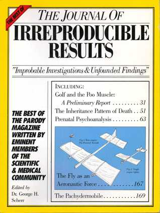
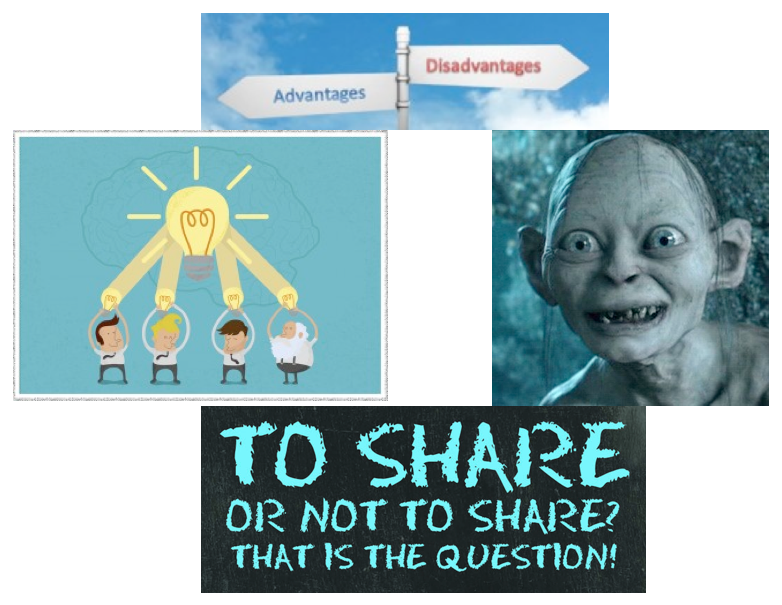
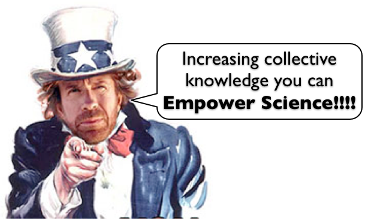
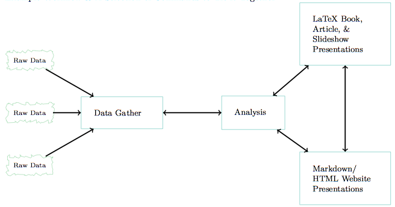
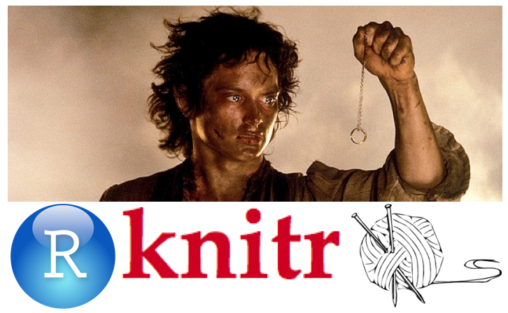
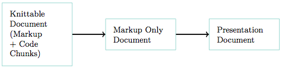
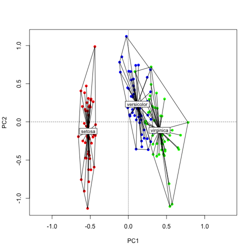

Reproducible Research
========================================================
<small>
author: Juan Galán-Páez<br>
date: 17/12/2014
</small>
<center>

</center>

Outline
========================================================

- Motivation
- Reproducible Research
  - Phases
  - Golden rules
- R & RStudio based workflow
  - Knitr
  - knitr code chunks
- References
- Examples

Motivation
========================================================

### <u>Mainstream practices in current research</u>

- Data sources not published
- Source code not published
- Experiments are literally depicted
  - thus, almost impossible to reproduce
- Reproducing usually takes same amount of time (or more) than performing the original research
- That slows down dramatically the advance of science


Top Ten Reasons To Not Share Your Code
========================================================
<small>By <i>Randall J. LeVeque</i>

1. The proof is too ugly to show anyone else
2. I didn't work out all the details
3. I didn't actually prove the theorem---my student did
4. Giving the proof to my competitors would be unfair to me
5. The proof is valuable intellectual property
6. Including proofs would make math papers much longer
7. Referees would never agree to check proofs
8. The proof uses sophisticated mathematical machinery that most readers/referees don't know
9. My proof invokes other theorems with unpublished (proprietary) proofs
10. Readers who have access to my proof will want user support

</small>

Researchers nowadays are always in a rush
========================================================

### Leading to dubious methods: <small>
- Case selection
  - Maximizing method performance
- Data selection (idem)
- The method only works on toy problems
- Proofs are faulty (just slightly **:)**)
- The code is...
  - Dirty
  - Unreadable
  - Not tested/fault-prone
- Simply don't want to share my data/code **It's my treasure!!**
</small>

Why should I share my efforts then?
========================================================


 Open Knowledge
========================================================


The power of Open knowledge
========================================================
- Thousands of collaborators and reviewers
  - Receive feedback and corrections
- Improve your work's impact
- Your are forced to provide clean code and reliable results
  - Your workflow will be improved
- Your work will be really useful
- Important journals require it

Reproducible research
========================================================
- Beneficial for the community:
  - Any one can reproduce the claims posed in a paper
  - The whole process (from data gathering till results reporting) is transparent for the reader
- Beneficial for yourself:
  - Dynamic workflow. Changes in any phase of your work are reflected in the others
  - Even you will be able to reproduce your own work after one year. Seriously!!!

Research phases
========================================================
- Main phases are:
  - Data gathering and pre-processing
  - Data analysis
  - Results reporting
- Every process should be tied to the rest


Golden rules for reproducible research 
========================================================
- Everything is a text (Say no to binaries!!!!)
- Everything is a command (Say no to GUI buttons!!!)
  - Install packages, load libraries, download files ...
- For the sake of clarity. COMMENT everything!!!!
  - Everything should be human readable
- Never write a result. Tie the document and the source
- Provide... 
  - Every file, source or reference.
  - Every software/package version and source

An R & RStudio based workflow
======================================================== 
- Data gathering and preparation:
  - R, Shell, python, GNUMake, etc.
  - Any in which you can code
- Statistical analysis:
  - R language
  - But I have a magical python script... Ok, nothing is impossible
- Integration with RStudio IDE

An R & RStudio based workflow
======================================================== 
- Presentation:
  - Markup languages please (now we hate WYSIWYG editors)
  - LaTex documents
  - Beamer/Markdown slideshows
  - HTML/Markdown websites
  - **Pandoc** (document customization/conversion)
- Storing/sharing
  - Git (Github/BitBucket/GitLab)
  - Dropbox/GDrive (Just as a complement)
- Some commands/tools: see table 2.1 (p. 26)

One package to rule them all
========================================================


Knitr
========================================================
- R integration with markup documents
- Supports LaTex, Markdown, HTML, ¿?
- ¿Only R? R provides
  - Connection with many API/web services
  - Database connection
  - Supports many file types
  - System calls (thus everything...)
  


Code chunck example
========================================================

```r
names(cars)
```

```
[1] "speed" "dist" 
```

```r
summary(cars)
```

```
     speed           dist       
 Min.   : 4.0   Min.   :  2.00  
 1st Qu.:12.0   1st Qu.: 26.00  
 Median :15.0   Median : 36.00  
 Mean   :15.4   Mean   : 42.98  
 3rd Qu.:19.0   3rd Qu.: 56.00  
 Max.   :25.0   Max.   :120.00  
```

Code chunk options (eval/include)
========================================================

```r
names(cars)
summary(cars)
```

Code chunk options (echo)
========================================================

```
[1] "speed" "dist" 
```

```
     speed           dist       
 Min.   : 4.0   Min.   :  2.00  
 1st Qu.:12.0   1st Qu.: 26.00  
 Median :15.0   Median : 36.00  
 Mean   :15.4   Mean   : 42.98  
 3rd Qu.:19.0   3rd Qu.: 56.00  
 Max.   :25.0   Max.   :120.00  
```

Plot example
========================================================
<small> Source: https://joelkuiper.eu/R-workshop </small>
 

Plot Code
========================================================
<small> Source: https://joelkuiper.eu/R-workshop </small>

```r
library("vegan")

iris.c <- scale(iris[ ,1:4])
pca <- rda(iris.c)

plot(pca, type = 'n', display = 'sites')

cols <- c('red', 'blue', 'green')
points(pca, display='sites', col = cols[iris$Species], pch = 16)

ordihull(pca, groups=iris$Species)
ordispider(pca, groups = iris$Species, label = TRUE)
```

Always show session info
========================================================
<small> After loading packages

```r
sessionInfo()
```

```
R version 3.1.2 (2014-10-31)
Platform: x86_64-apple-darwin10.8.0 (64-bit)

locale:
[1] es_ES.UTF-8/es_ES.UTF-8/es_ES.UTF-8/C/es_ES.UTF-8/es_ES.UTF-8

attached base packages:
[1] stats     graphics  grDevices utils     datasets  methods   base     

other attached packages:
[1] vegan_2.2-0     lattice_0.20-29 permute_0.8-3   knitr_1.8      

loaded via a namespace (and not attached):
 [1] cluster_1.15.3 evaluate_0.5.5 formatR_1.0    grid_3.1.2    
 [5] MASS_7.3-35    Matrix_1.1-4   mgcv_1.8-3     nlme_3.1-118  
 [9] parallel_3.1.2 stringr_0.6.2  tcltk_3.1.2    tools_3.1.2   
```
</small>

Only for R?
========================================================

- For python exists *IPython Notebook*
  - Interactive (unlike knitr)
- The couple RStudio & Knitr provides full integration (unlike the rest)
- Others? Sure...
- IPython Notebook example:
  - http://nbviewer.ipython.org/github/josemazo/nyc-taxi-tip-predictor/tree/master/notebooks/

References
========================================================
- Reproducible Research - Christopher Grandud: http://christophergandrud.github.io/RepResR-RStudio/
- Top Ten Reasons To Not Share Your Code (and why you should anyway) - Randall J. LeVeque: http://www.siam.org/news/news.php?id=2064
- RStudio: http://www.rstudio.com/
- Knitr: http://yihui.name/knitr/
- **Pandoc:** http://johnmacfarlane.net/pandoc/
- **Repmis package:** http://cran.r-project.org/web/packages/repmis/index.html
- IPython Notebook: http://ipython.org/notebook.html


========================================================


Lets see a full example
========================================================
- Example project from the book Reproducible Research by Christopher Grandud
- Democracy level VS Fertilizer Consumption
- Source: https://github.com/christophergandrud/Rep-Res-ExampleProject1
- The book itself is another example
- Source: https://github.com/christophergandrud/Rep-Res-Book/

